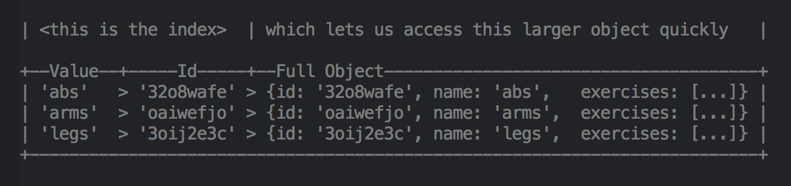

Я нещодавно проглядав деякі Javascript обговорення у чат-системі [RC](https://recurse.com/) і помітив чудове питання від [Кейт Рей](https://twitter.com/kraykray):

> Як структурувати дані в Redux сховищі?

Це питання є поширеним при використанні Redux, безперечно я неодноразово задавав його й собі. Відповідь, як правило, залежить від того, як я планую взаємодіяти зі своїми даними.

Є кілька речей які варто враховувати: чи часто я збираюся проходитись сховищем як по списку рядків? Чи потрібен швидкий `O(1)` доступ до окремих елементів?

На практиці я бачив кілька підходів, як правило, з деякими компромісами між часом доступу та простотою ітерації.

## Типові підходи

Якщо ви зберігаєте деякі дані де кожен елемент має ідентифікатор, можна формувати сховище як об'єкт або масив об'єктів.

### Масив пласких об'єктів `[{values}]`:

Найпоширеніший на сьогоднішні підхід серед тих що я бачив. Робить ітерацію простою, дозволяє зберігати дані в певному порядку, але нема можливості отримати доступ до певного елемента за `id` чи `name` без ітерації та фільтрації.

```js
categories: [
  { name: 'abs',  id: '32o8wafe', exercises: ['crunches', 'plank'] },
  { name: 'arms', id: 'oaiwefjo', exercises: [...] },
  { name: 'legs', id: 'aoijwfeo', exercises: [...] },
]
```

### Об'єкт з ключам-ідентифікаторами `{id: {values}}`:

Цей підхід дає вам швидкий `O(1)` доступ до кожного елемента, але нема можливості отримати доступ до `id` певного елемента під час ітерації за допомогою `Object.values()`.

```js
categories: {
  '32o8wafe': { name: 'abs',  exercises: ['crunches', 'plank'] },
  'oaiwefjo': { name: 'arms', exercises: [...] },
  '3oij2e3c': { name: 'legs', exercises: [...] },
}
```

```js
Object.values(categories).map(row => /* нема доступу до `id` звідси */)
// можна використати Object.entries, але синтаксис row.id не працюватиме
```

> #### Їжа для роздумів:
> Масиви та об'єкті [це одні й ті самі речі в JS](https://developer.mozilla.org/en-US/docs/Web/JavaScript/Reference/Global_Objects/Array#Description).  
> (Хоча V8 використовує різні внутрішні подання для їх збереження)


## Структуруйте його як базу даних з індексом на id

На нашому шляху реалізації великого Redux додатка у [Monadical](https://monadical.com/), ми натрапили на інший підхід, який дає нам перевагу як простої ітерації з `Object.values` (`state.categories`) так і швидкого `O(1)` доступу до окремих елементів:

```js
categories: {
  '32o8wafe': { id: '32o8wafe', name: 'abs',  exercises: [...] },
  'oaiwefjo': { id: 'oaiwefjo', name: 'arms', exercises: [...] },
  '3oij2e3c': { id: '3oij2e3c', name: 'legs', exercises: [...] },
}
```

Зауважте, що `id` виступає як ключем рядка, та і властивістю самого рядка. Це невелике дублювання дає нам значну гнучкість у часі доступу. Цей підхід також сумісний з [нормалізованою](http://redux.js.org/docs/recipes/reducers/NormalizingStateShape.html) (також відомою як *пласка*) структурою, яку радить документація Redux.

Тепер можна працювати з `id` під час ітерації!

```js
Object.values(categories).map(cat => ({ id: cat.id, name: cat.name }))
```

Або витягнути будь-який окремий елемент через `id` миттєво:

```js
categories['32o8wafe'].name // 'abs'
```

Ми надсилаємо наші дані фронтенду уже у такому форматі, тому нема потреби робити перетворення у формат `<id>: <значення>`. З бекенд-частини робити це легко, оскільки, дані ймовірніше всього дістаються з бази даних, де вже є поле `id`, яке можна використати як ключ.

## Сила індексів

Цей новий формат є тривіальною зміною, і ймовірно жодна команда не витрачатиме багато часу на його обмірковування проектуючи своє redux сховище. Справжня магія, втім виникає, коли ми отримуємо доступ до даних сховища за допомогою інших ключів окрім `id`.

Зазначте, що вищезгаданий формат — це лише список рядків, з ключем, який використовується для унікальної ідентифікації кожного рядка. Маючи таку структуру сховища, можна створювати індекси що дозволяють мати доступ `O(1)` за будь-яким іншим бажаним ключем:

### Індекс категорій за назвою:

Щоб зробити індекс, ми пишемо функцію, яка бере дані сховища, і повертає перетворення `name -> id`.

```js
const index_by_name = (categories) =>
    Object.values(categories)
          .reduce((obj, row) => (obj[row.name] = row.id, obj), {})
```

```js
// {abs: '32o8wafe', arms: 'oaiwefjo', legs: '3oij2e3c'}
```



```js
const ids_by_name = index_by_name(categories)
```

```js
categories[ids_by_name['abs']] // {id: '32o8wafe', name: 'abs', ...}
```

Для одного набору даних можна створити скільки завгодно індексів, що надає вам доступ `O(1)` на основі будь-якого стовпця, так само як і в базі даних.

Якщо дані не змінюються, індекси достатньо просто один раз обчислити, в іншому випадку їх слід перерахувати за допомогою мемоізованих (`memoized`) функцій.

> #### Їжа для роздумів:
> Як зробити індекси для ключів що не є унікальними?


## Впорядковані дані

Що робити, якщо вашим категоріям властивий порядок (як, наприклад, у масиві), і вам потрібно мати можливість їх витягувати у правильному порядку під час проходження?

Ви можете подумати зробити щось на кшталт:

```js
const category_order = ['32o8wafe', 'oaiwefjo', '3oij2e3c']
category_order.map(id => categories[id])
```

Це хороший підхід, однак він вимагає збереження масиву що забезпечує порядок окремо від наших даних, що є неоптимальним. Зробімо це правильно з індексами.

Ми надсилаємо дані з нашого бекенду з ключем `order` (або `idx`) що вказує позицію елемента, потім **робимо індекс за ключем `order` так само як ми б робили для будь-якого іншого ключа**:

```js
const ids_by_order =
      Object.values(categories)
            .reduce((ordered_ids, category) => {
                        ordered_ids[category.order] = category.id
                        return ordered_ids
                    }, [])
```

```js
// ['32o8wafe', 'oaiwefjo', '3oij2e3c']
```

Зверніть увагу, що ця операція `reduce` створює масив індексів, а не об'єкт. Масив у JavaScript насправді є лише об'єктом з ключами 0, 1, 2, ..., тому тепер ми маємо як `O(1)` доступ до певного `id` за ключем `order`, так і можливість використовувати `map`, `filter` та `reduce` на упорядкованому списку:

```js
const second_category = categories[ids_by_order[1]]
// {id: 'oaiwefjo', name: 'arms', order: '1'}
```

```js
const ordered_names = ids_by_order.map(id => categories[id].name)
// ['abs', 'arms', 'legs']
```

> #### Їжа для роздумів:
> Чому цей підхід працюватиме, навіть коли порядкові номери мають прогалини? наприклад 0, 2, 41, 399

## Мемоізація

Якщо ваші дані не змінюються, можна викликати `ids_by_key` один раз під час запуску і після цього кожного разу використовувати створений індекс у якості статичного об'єкта. Втім якщо ви працюєте з динамічними даними які часто читаються, мемоізація є надзвичайно важливою, щоб уникнути повторного обрахунку індексу під час кожного доступу (що є `O(n)`).

Мемоізовані селектори індексів можна отримати за допомогою [reselect](https://github.com/reactjs/reselect) або написанням власної функції мемоізації (що не є надто складним в залежності від ваших даних).

Мемоізовані індекси означають виклик функції індексу під час кожного читання, замість того, щоб зберігати індекс у Redux сховищі.

Шаблон плаский даних з індексами, який я описав вище, також узгоджується з шаблоном, використовуваним бібліотекою [Normalizr](https://github.com/paularmstrong/normalizr). Якщо вам імпонує зберігання своїх даних у пласкій формі (розділених за типом) і до вподоби концепція індексу представлена в цій статті, почитайте про Normalizr в документації [Redux Without Profanity](https://tonyhb.gitbooks.io/redux-without-profanity/content/normalizer.html).

Альтернативною мемоізації може бути мутація існуючого індексу під час додавання або видалення ключів. Дизайн який в підсумку ви використовуватимете, залежить від ваших шаблонів доступу до даних.

> #### Їжа для роздумів:
> Мемоізація використовуючи `.hash()` на об'єктах `immutable.js` є [швидкою](https://egghead.io/lessons/javascript-lightning-fast-immutable-js-equality-checks-with-hash-codes).


## Функції вищого порядку для індексів

**Всі індекси є чистим результатом наших даних**, тому ми також можемо створити круті функції вищого порядку (також відомі як функції що повертають функції) для індексів, для прикладу:

```js
const ids_by_key = (key) => (data) =>  // make index(data) for key
      Object.values(data)
            .reduce((index, row) => {
                        index[row[key]] = row.id
                        return index
                    }, {})
```

```js
const ids_by_name = ids_by_key('name')  // returns an index function
const abs_id = ids_by_name(categories)['abs']
// '32o8wafe'
```

> #### Їжа для роздумів:
> Напишіть функцію для створення індексів за кортежем двох ключів: `'${row[key1]}-${row[key2]}' -> id`

## Чому хоч щось з цього має значення?
 
> React та Flux / Redux розв'язали проблему […] рендерингу та управління даними. Зараз стало можливим створювати справді передові веб-додатки, орієнтуючись на фактичний домен, а не боротися з внутрішньою реалізацією.
>
> Однак проблема полягає в тому, що системи постійно зростають. Ми створюємо більше графічних інтерфейсів і завантажуємо та перетворюємо ще більше даних…
> — Роман Лютіков: [Про веб-додатки та бази даних](https://medium.com/@roman01la/on-web-apps-and-databases-c026f77b93f4)


Коли фронтенд частини починають наближатися по складності до бекенд частин, ми продовжуємо повторно реалізовувати речі, які вже десятиліттями існують на бекенді: бази даних, черги повідомлень та інша стереотипно серверна інфраструктура. Багато підходів фронтенду, що вважаються сучасними — як от функціонально-реактивне програмування — існують [з часів Windows 3.1](https://tomjoro.github.io/2017-02-03-why-reactive-fp-sucks/).

Уроки керування станом, засвоєні нами у 90-х від баз даних SQL, можуть бути застосовані до фронтенду, щоб допомогти нам зберегти чіткість, елегантність та узгодженість даних. Використання індексів для уникнення дублювання та перехід до конкретних частин центрального, послідовного набору даних є одним із таких прикладів, і я впевнений, що є ще багато інших, що мені ще належить відкрити.

## Подальше ознайомлення

Якщо вам хочеться більше функцій від баз даних у браузері, зацініть: [redux-orm](redux-orm), [IndexedDB](https://developer.mozilla.org/en-US/docs/Glossary/IndexedDB) (заміна Web SQL), та [GraphQL](http://graphql.org/). Та пам'ятаєте, що не слід встановлювати бібліотеки допоки ви не впевнені навіщо вони вам потрібні.

- http://redux.js.org/docs/basics/Reducers.html#designing-the-state-shape
- http://redux.js.org/docs/recipes/reducers/NormalizingStateShape.html
- https://egghead.io/lessons/javascript-redux-normalizing-the-state-shape
- https://stackoverflow.com/questions/33940015/how-to-choose-the-redux-state-shape-for-an-app-with-list-detail-views-and-pagina
- https://stackoverflow.com/questions/34995822/how-to-get-best-practice-react-redux-nested-array-data
- https://codeburst.io/how-to-store-your-state-data-f17ceca37aa
- https://tonyhb.gitbooks.io/redux-without-profanity/content/normalizer.html
- https://github.com/tommikaikkonen/redux-orm

## TL;DR

- Зберігайте дані свого сховище у нормалізованому вигляді `{id: {id, attr1, attr2, attr3}}`
- Зробіть індекси `{attr: id}` для швидкого `O(1)` доступу за допомогою інших ключів, наприклад `ids_by_name`
- Ітеруйтесь відсортованими даними за допомогою індексу масиву `ids_by_order.map(id => data[id])`
- Якщо ваші дані часто змінюються використовуйте чисті функції для створення індексів та мемоізовуйте їх
